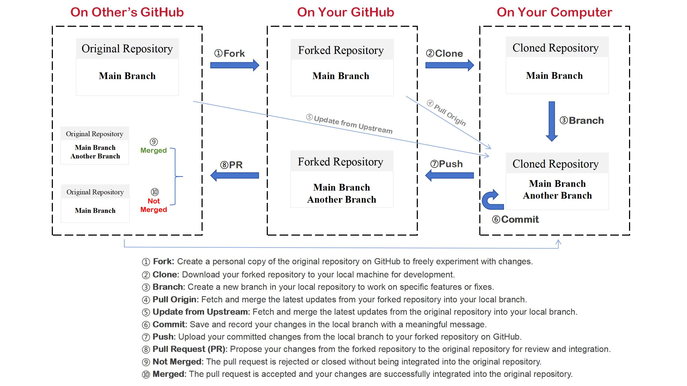

# Why We Use Git & GitHub

We've already talked about that Git and GitHub are the foundation of Docs-like-code workflow. To understand why they are so powerful, let's break down how they work and how they enable version control and collaboration. In the first, we need to know the concept of the repository in Git.

## 1. The Three Layers of Git: Remote, Forked, and Local repositories

Git operates across three main layers:

1. **The Original Repository (Remote)**

    This is the main project hosted on GitHub (e.g., a popular open-source project like VS Code).

    - You can view the code and documentation, but you **can't directly edit it**.
    - To contribute, you need to create your own copy.

2. **Your Forked Repository (Remote)**

    Forking creates a **personal copy** of the original repository under your GitHub account.

    - This is where you can freely make changes without affecting the original project.
    - Think of it as your own "sandbox" to experiment and contribute.

3. **Your Local Repository**

    This is the copy of the repository on your computer.

    - You can edit files, test changes, and commit updates here.
    - Once you're happy with your changes, you can push them back to your forked repository.

Then how the three layers enable git achieve version control and collaboration. To understand it, we need to know previously the total workflow of Git and GitHub, as well as some terms.

## 2. The workflow of Git

We use a robot metaphor to understand the relationships between three repositories and the entire Git workflow.

- **Forking**: When you fork a repository, you create your own copy to work on.

- **Cloning**: After forking, you clone the repository to your local computer.

- **Branch**: Create a new branch for your changes, following the project’s naming conventions and edit the local files in this branch to implement your updates.

- **Commits**: Each time you save a change, Git creates a "commit" (a snapshot of your project at that moment).

- **Pushing**: Once you've made changes, push them to your forked repository.

- **Pull Requests**: When your changes are ready, submit a Pull Request (PR) to the original repository.

- **Merge**: The original repository’s maintainers review your changes and decide whether to merge them.

- **Pull**: Before every time starting new modifications, always pull the latest version from the original repository to ensure your work is based on the newest updates.

- **Update from Upstream**: Fetch and merge changes from the original repository into your local branch to keep it updated. Then, push these updates from your local repository to your forked repository to maintain compatibility with the latest project state.

///caption
Git Workflow Chart
///

## 3. How Git Enables Version Control and Collaboration

Git serves as a crucial tool for version control and collaboration in digital projects. It systematically tracks all changes to project files, allowing developers to manage different versions effectively. Moreover, it enables multiple teams to work concurrently. This two - fold functionality ensures that new features can be safely developed and tested in separate environments before being integrated into the main project.

### Version Control

Git tracks changes through commits and branches, enabling precise version control. Each commit records who made the change, when it was made, and a description of the modifications.

### Collaboration

Anyone can contribute to the original repository from anywhere, at any time. By working in their own forked repositories and branches, collaborators avoid interference and enable parallel development.

## Next Steps

Now that you understand why Git and GitHub are so powerful, let's dive into **how to use them** with GitHub Desktop in the next section.
