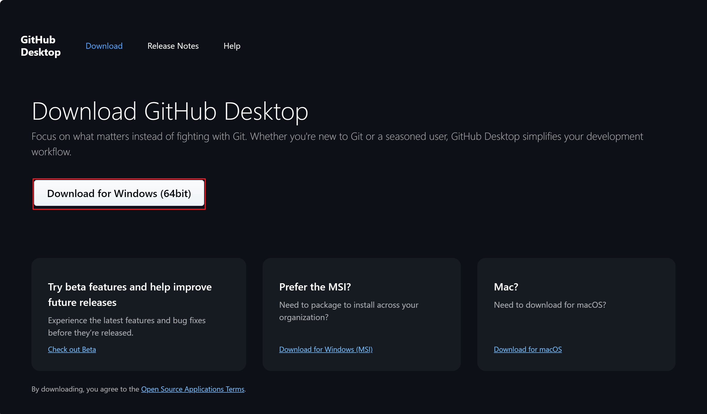

# Preparation

We need to sign up a GitHub account first and download two tools: GitHub Desktop and Visual Studio Code.

## A GitHub Account

Head to [GitHub website](https://github.com/) and sign up an account.

{width="800"}
///caption
GitHub Official Website
///

## Download GitHub Desktop

GitHub Desktop is an GitHub Desktop is a GUI application provided by GitHub that simplifies common Git operations, allowing users to manage Git repositories without using the command line. It is especially suitable for those who are not familiar with command-line tools. [**Clike to view download page**](https://desktop.github.com/download/)

{width="800"}
///caption
GitHub DeskTop Download Page
///

## Download Visual Studio Code

Visual Studio Code(or VSCode) is an IDE(Integrated Development Environment) used to edit documents. An IDE (Integrated Development Environment) is a software application that provides comprehensive tools for writing and managing code, but here for documentation.

Head to [the official website of VSCode](https://code.visualstudio.com/) and Click download.

{width="800"}
///caption
Visual Studio Code Download Page
///
