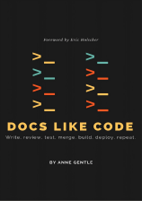

# Introduction of the guide

Before we start the detailed learning of docs-like-code workflow, let's take few minutes to understand it from a general perspective.

{ align=left }

Most of the content in this guide is from the book ***Docs-Like-Code***. I just make a simple summary of this book combined with my own experiences with this workflow.

It advocates integrating documentation with development workflows, treating docs as code. It emphasizes version control, automation, and collaboration to manage documentation alongside code. Through examples, the book shows how to improve quality, maintainability, and teamwork, ideal for technical writers and developers.

## Why treat docs like code?

Treating docs like code means that make writing documents and writing codes the same way.

Then, what does the way that code goes?

Mostly, programmer write and manage code in the following process and tools:

1. Edit code in [an IDE(Integrated Development Environment)](preparation.md#download-visual-studio-code) like Visual Studio Code.
2. Store and review code with code hosting platform like GitHub
3. Collaborate and manage different versions with Git Branches.
4. Tracking issues in Github
5. Publish automatically with CI/CD systems like Github Actions.

Then, docs-like-code approach encourage us to write documents in the same process and related tools. You can see that this workflow leans heavily on [Git and GitHub](preparation.md#download-github-desktop), which will be introduced in detail.

For more detailed purposes and introduction, you can read the book Docs-Like-Code. This guide is mainly focused on practices.

## Structure of the guide

This guide is designed to help you master the **Docs Like Code** workflow through the following key sections:

!!!note "Note"

    While the Docs-like-code workflow involves **more than just tools like Git and GitHub**, given the length of this document and GitHub's popularity, the focus here is primarily on Git and GitHub.

1. [**Git & GitHub**](git-and-github/basics.md### What is Git?)
    - Introduction: Git and GitHub for version control.
    - Collaboration workflows: Pull Requests, branching, and team collaboration
    - GitHub Desktop: A graphical user interface for easier Git management

2. [**Markdown Essentials**](markdown/intro.md#introduction-to-markdown)
    - Introduction: Markdown syntax for lightweight documentation.
    - Advanced formatting: Tables, code blocks, diagrams ...

3. [**Docs Like Code Workflow**](workflows/doc-like-code.md#what-is-doc-like-code)
    - End-to-end workflow: From writing to publishing.
    - Real-world examples: Explore open-source projects that use Docs Like Code.
    - Hands-on practice: Create your first Pull Request and experience the "Hello World" of Docs Like Code.

4. **MkDocs: Building Documentation Sites**
    - Set up: Generate static websites from Markdown.
    - Customization: Themes and plugin integration.
    - Deployment: Automate documentation publishing to GitHub Pages.

5. **Tools & Resources**
    - Curated tools: Open-source options like Sphinx, Docusaurus.
    - Learning resources: Technical writing courses and community guidelines.
    - Quick references: Templates and cheat sheets for efficient use.
