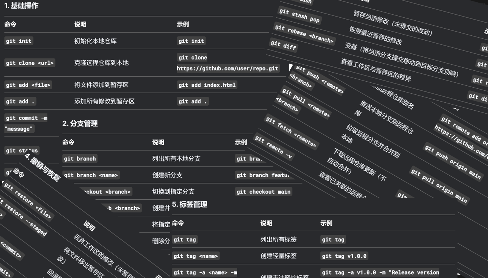

# GitHub Desktop: 无需编写代码的工具

前面我们讲解了 Git 的基本操作和工作流程，比如克隆、分支、提交和推送。虽然这些功能很实用，但都需要在命令行中输入指令，对新手来说可能会有些挑战。

令人望而生畏的 Git 命令

GitHub Desktop 用图形化界面大大简化了 Git 的操作，让你可以轻松上手，更专注于内容本身，而不用担心复杂的命令。

## 为什么使用 GitHub Desktop?

GitHub Desktop 的设计初衷是让 Git 更加易用，特别适合刚接触版本控制的朋友。它的优势体现在以下几个方面：

1. 无需命令行操作

   通过友好的界面完成所有 Git 操作（如克隆、分支、提交），非常适合不熟悉终端命令的用户。

2. 可视化工作流程

   以清晰的图形方式展示仓库的历史记录、分支和变更，方便你轻松跟踪已完成的工作和接下来的任务。

## 下一步
了解了 GitHub Desktop 如何让 Git 变得更简单后，接下来我们将学习 Markdown 的基础知识，掌握文档的写作与排版技巧。在后续的 Docs Like Code 工作流程部分，还会带你实际操作，看看如何用 GitHub Desktop 管理真实的文档项目。
