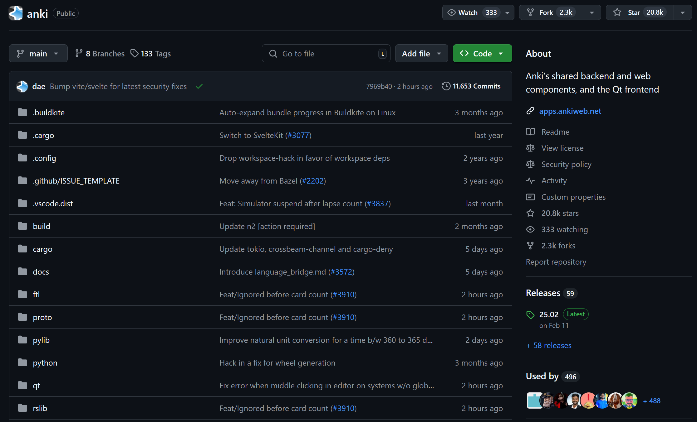
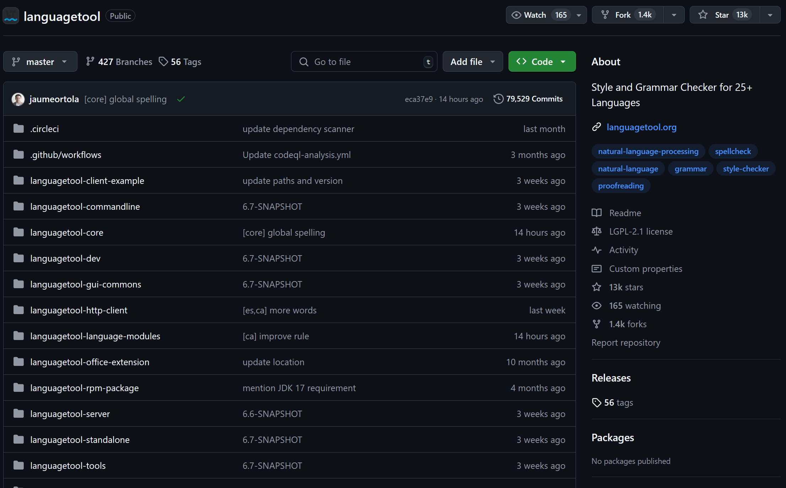

# Git & GitHub: The Foundation of Docs Like Code

In this part, we will quickly have an brief introduction of Git and GitHub.

## What is Git?

Git is a distributed version control system designed to track changes in files. It serves two primary purposes:

1. **Version Control**

    Git acts like a "time machine" for your files, recording every change you make. This allows you to:

    - **Easily revert to a previous version** if anything goes wrong with the current state.
    - **Quickly compare changes across different versions** for better understanding and tracking.
    - **Keep a comprehensive history of your project**, ensuring all updates are well-documented.

2. **Collaboration**

    Git enables multiple people to work on the same project simultaneously without conflicts. Key features include:

    - Branching: Creating separate branches allows **each participant to work independently** without affecting others' edits or the main project.

    - Merging: Seamlessly combine changes from different branches into the main branch or another target branch, ensuring that **all contributions are integrated smoothly**.

    - Conflict Resolution: When two people modify the same part of a file, Git provides mechanisms to **identify and resolve these conflicts**, ensuring that the final version reflects the intended changes from all contributors.

## What is GitHub?

GitHub is a platform built on top of Git, offering tools for collaboration and code hosting:

- **Host Repositories**: Store your code and documentation in the cloud.
- **Collaborate**: Use Pull Requests to propose changes and discuss improvements.
- **Social Coding**: Star, Fork, and contribute to open-source projects.

## What is Open Source?

Open source means making the source code of a project publicly available, allowing anyone to view, modify, and distribute it. Some benefits of open source include:

- **Innovation**: Encourages collaboration and sharing of ideas.
- **Quality**: More eyes on the code lead to fewer bugs and better solutions.
- **Community**: Builds a global network of contributors and users.

### Famous Open Source Projects

Here are some well-known open-source projects you might have heard of:

=== "Anki"
    
=== "DeepSeek"
    
=== "VS Code"
    
=== "LanguageTool"
    

## How Git and GitHub Relate to Docs Like Code

In the Docs Like Code workflow:

- **Git** is used to version control your documentation, just like code.
- **GitHub** provides a platform for collaboration, allowing multiple contributors to work on the same documentation.
- **Open Source** principles align with Docs Like Code: transparency, collaboration, and sharing.
