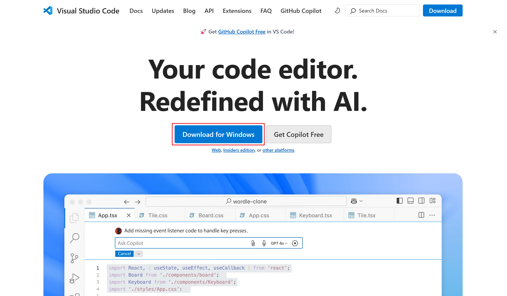

# 准备工作

我们需要先注册一个Github账号 （**a GitHub account**）并下载两个工具： **GitHub Desktop** and **Visual Studio Code**。

## 注册引导：下载 GitHub Desktop

GitHub Desktop 是由 GitHub 提供的图形用户界面（GUI, Graphic User Interface）应用程序，能够简化常见的 Git 操作，让用户无需使用命令行即可管理 Git 仓库。该工具适合不熟悉命令行操作的用户。([*点击查看下载页面*](https://desktop.github.com/download/)).

{width="800"}
///caption
GitHub DeskTop 下载页面
///

##  注册引导：创建GitHub 账户

请访问 [*GitHub 官网*](https://github.com/) 创建账户， 随后按照屏幕指引登录 GitHub Desktop。若未出现登录提示，可通过菜 `文件 -> 选项 -> 账户 -> 登录` 完成认证

{width="800"}
///caption
GitHub 官网
///

## 下载Download Visual Studio Code

 Visual Studio Code（简称VSCode）是一款开发者常用的集成开发环境（IDE），同样也适合于文档编辑工作。虽然IDE原本是为代码开发设计的工具，但VSCode凭借其强大的扩展性，已成为技术文档编写的利器。

请前往 [ Visual Studio Code 官网  *the official website of VSCode*](https://code.visualstudio.com/) 点击下载。

{width="800"}
///caption
Visual Studio Code 下载页
///

!!! 注意
    分网站可能需要配置 VPN 才能流畅访问。
